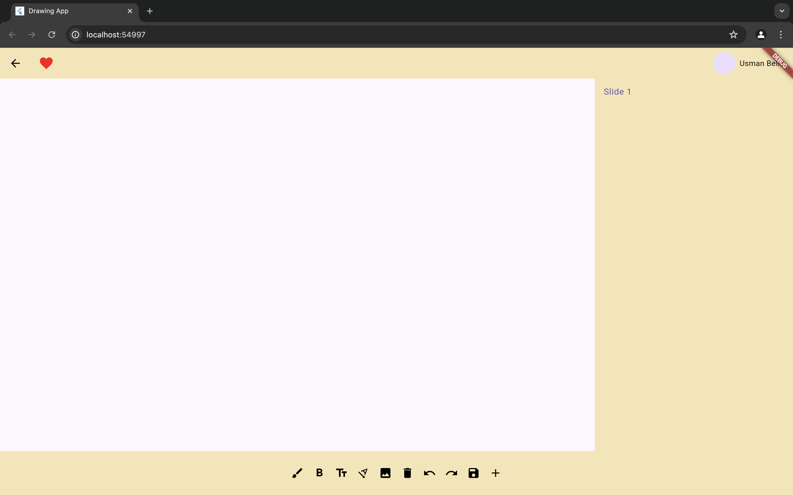
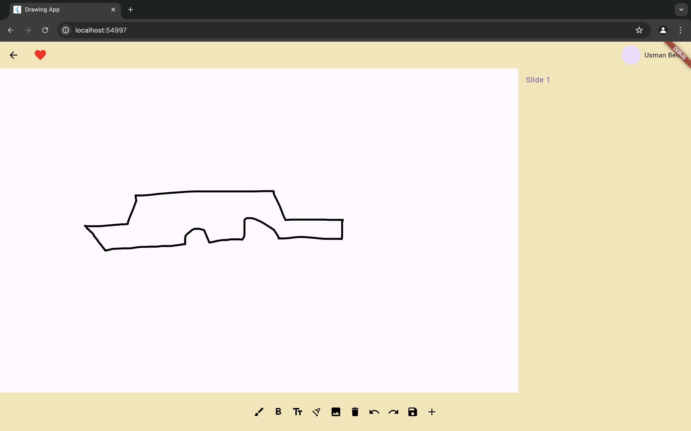

# Drawing App

A simple drawing app using Flutter.

- [x] Draw with touch
- [x] Clear the canvas
- [x] Save the drawing to device storage
- [x] Load previous drawings from device storage

### Screenshots

  
  

### How to use

1. Clone this repository
2. Open the project in your preferred IDE
3. Run the app on an emulator or a physical device

### Contributing

Feel free to contribute to this project by submitting pull requests or opening issues.

### License

This project is licensed under the MIT License - see the [LICENSE](LICENSE) file for details.
